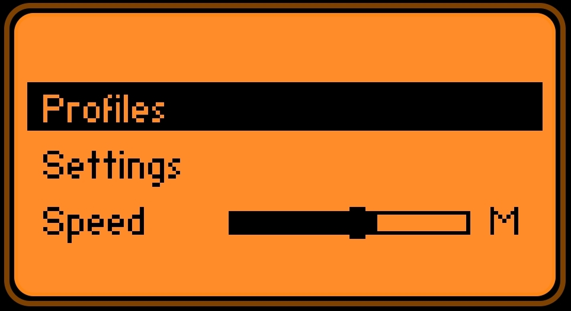

# 📡 Flipper Zero Ham Radio Scanner

A lightweight SubGHz radio scanner, designed to behave like a simple handheld scanner for common radio bands.

---

## ✨ Features

  * Scan predefined radio channel groups
  * PMR446, FRS/GMRS
  * Adjustable squelch (signal threshold)
  * Resume modes : 
    - Lock (stop on signal)
    - Delay (resume after timeout)
    - Hold
  * Adjust scanning speed. F (Fast and less accurate), M (Medium), A (Accuracy) 
  * Manual channel switching when scanning is paused

---

## 📸 Screenshots

  
  

---

## 🎮 Controls

### Main Screen

* **OK** → Open Menu
* **LEFT / RIGHT** → Toggle scanning on/off (HOLD)
* **UP / DOWN** → Change channel (ONLY available when scanning is on HOLD)
* **BACK** → Exit app

---

### Menu

### Profiles

* Select band:

  * PMR
  * FRS/GMRS

---

### Settings

* **Resume Mode** → Behavior after signal detection
* **Squelch** → Adjust signal threshold

---

### Squelch Screen

* **LEFT / RIGHT** → Adjust sensitivity
* **OK / BACK** → Return

---

## ⚠️ NOTES!

* This app uses the internal CC1101 Sub-GHz radio, which has some limitations.
* Reception quality depends on environment and antenna.
  Experiment with your radios voltage output and the apps squelch level.
* Scanning FRS/GMRS band! Remember, some channels like CH-6 (462.687) and CH-20 (462.675) 
  are very close to each other, so scanner might choose one or the other.
* When testing, hold your flippers antenna close to your radios antenna.
* When putting scan on HOLD, Exiting app or entering Menu, give it a couple of seconds. Its working HARD!

---

Developed by **Clawzman**  

## 🔗 Source

https://github.com/Clawzman/Flipper-HAM-Scanner
